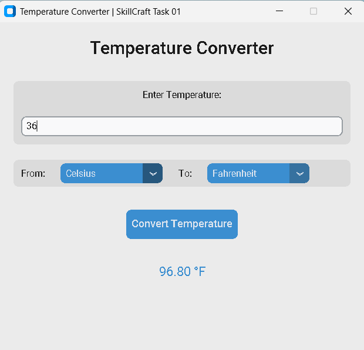
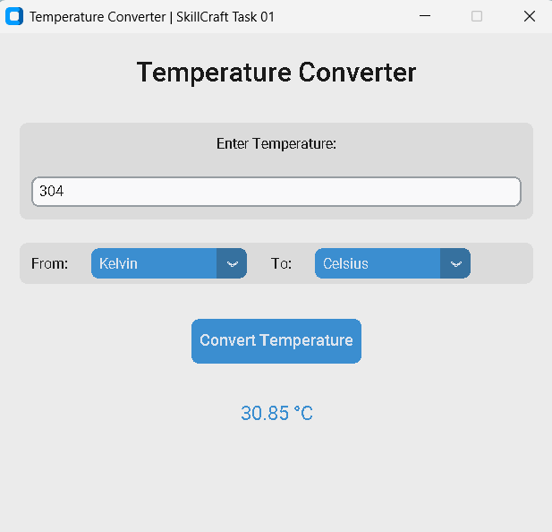

# Temperature Converter App 🌡️
**SkillCraft Technology Internship | Task 01**


## 📋 Description
A modern, user-friendly desktop application built with Python and `CustomTkinter` that performs real-time temperature conversions. Unlike standard console scripts, this application features a fully responsive Graphical User Interface (GUI) with dark mode support.

This project was developed using **Visual Studio Code** as part of the **SkillCraft Technology** internship program (Software Engineering Track).

## ✨ Features
* **Modern UI/UX:** Built with `CustomTkinter` for a professional, dark-themed aesthetic.
* **Universal Conversion:** Supports **Celsius**, **Fahrenheit**, and **Kelvin** scales.
* **Robust Error Handling:** Graceful handling of non-numeric inputs prevents crashes.
* **User-Driven Design:** Clear layout with dropdown menus for easy selection.

## 📸 Screenshots & Demo

### Application Interface



### 🎥 [Watch the Demo Video](demo_video/demo_video.mp4)

## 🛠️ Installation & Run
To run this project locally, follow these steps:

1.  **Clone the repository:**
    ```bash
    git clone [https://github.com/Adithyanps47/SCT_SE_1.git](https://github.com/Adithyanps47/SCT_SE_1.git)
    cd SCT_SE_1
    ```

2.  **Install the required dependency:**
    ```bash
    pip install -r requirements.txt
    ```

3.  **Run the Application:**
    ```bash
    python temperature_gui.py
    ```

## 📂 Project Structure
* `temperature_gui.py`: Main application script
* `requirements.txt`: Dependencies list
* `README.md`: Project documentation
* `Screenshots/`: Folder containing app images
* `demo_video/`: Folder containing the demo video

## 💻 Tech Stack
* **Programming Language:** Python 3.13.6
* **GUI Library:** CustomTkinter (Modern UI wrapper for Tkinter)
* **Development Environment:** Visual Studio Code
* **Version Control:** Git & GitHub

## 👨‍💻 Author
**Adithyan P S**
* **Role:** Software Engineering Intern
* **LinkedIn:** [Adithyan P S](https://www.linkedin.com/in/adithyan-p-s-mobile/)
* **GitHub:** [@Adithyanps47](https://github.com/Adithyanps47)

---
*Developed for SkillCraft Technology Internship | Task 01*
